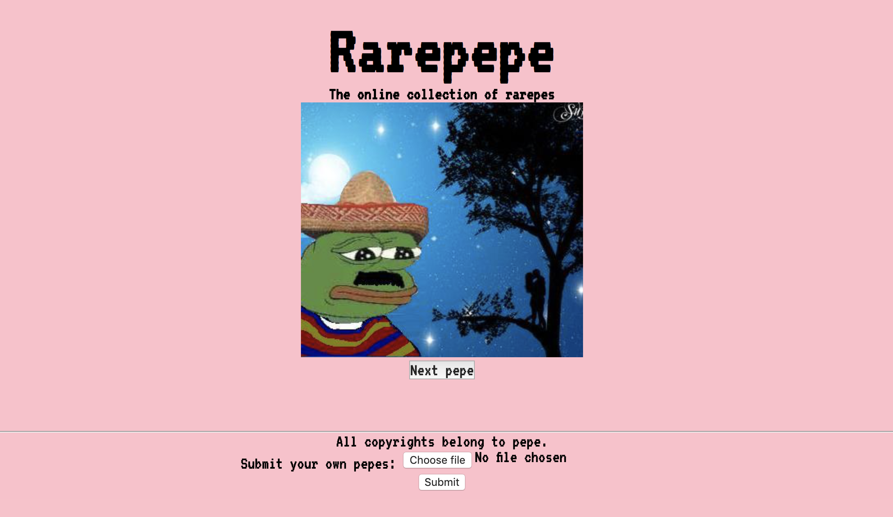

# Pepeweb
> A web that gives you random pepes! Visit http://www.pepeweb.org/

One to two paragraph statement about your product and what it does.

## Development setup

Fully serverless implementation with appengine on gcloud. The web retrieves pepes tagged as approved from a g-datastore instance. Submitting pepes from the web interface is allowed and will be stored waiting for approval to appear on the web.

## Release History

* 0.0.1
    * First release 

## Meta

Distributed under the MIT license. See ``LICENSE`` for more information.

[https://github.com/jiwidi/pepeweb](https://github.com/jiwidi/)

## Contributing

1. Fork it (<https://github.com/jiwidi/pepeweb/fork>)
2. Create your feature branch (`git checkout -b feature/fooBar`)
3. Commit your changes (`git commit -am 'Add some fooBar'`)
4. Push to the branch (`git push origin feature/fooBar`)
5. Create a new Pull Request

